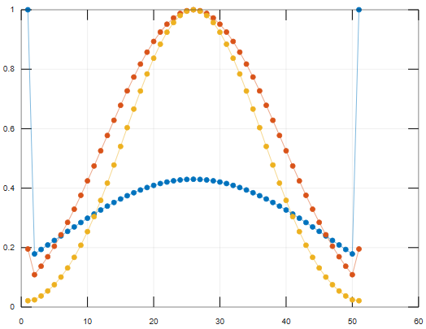
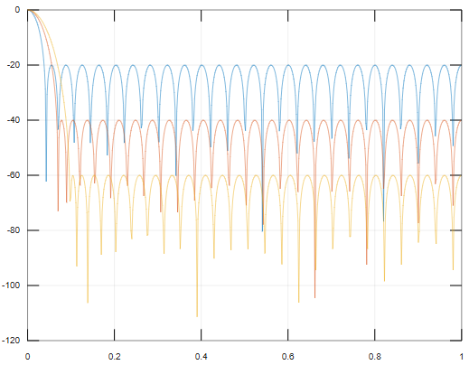
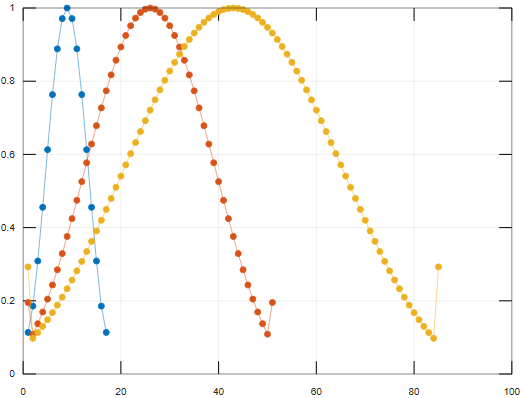
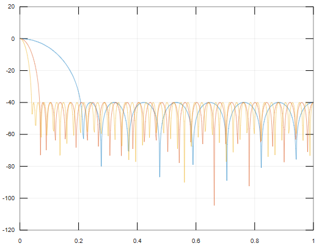

# Лабораторная работа №1

## Задание
Построить графики оконной функции Чебышева во временной и частотной областях в линейном и полулогарифмическом масштабах. Исследовать поведение этой функции при различных входных параметрах.

### [Ссылка на Octave](https://octave-online.net/)

График 1. Временная область, изменение параметра $Rs$
```MATLAB
n = 51;
Rs1 = 20;
Rs2 = 40;
Rs3 = 60;
x = 1:1:51;
w1 = chebwin(n, Rs1);
w2 = chebwin(n, Rs2);
w3 = chebwin(n, Rs3);
plot(x, w1, ".-", x, w2, ".-", x, w3, ".-"), grid
```


График 2. Частотная область, изменение параметра $Rs$
```MATLAB
[W1, f1] = freqz(w1, 1, 512, 2);
[W2, f2] = freqz(w2, 1, 512, 2);
[W3, f3] = freqz(w3, 1, 512, 2);

plot(f1, 20*log10(abs(W1)/sum(w1)),
     f2, 20*log10(abs(W2)/sum(w2)),
     f3, 20*log10(abs(W3)/sum(w3))), grid
```


График 3. Временная область, изменение параметра $n$
```MATLAB
n1 = 17;
n2 = 51;
n3 = 85;
Rs = 40;
x1 = 1:1:17;
x2 = 1:1:51;
x3 = 1:1:85;
w1 = chebwin(n1, Rs);
w2 = chebwin(n2, Rs);
w3 = chebwin(n3, Rs);
plot(x1, w1, ".-", x2, w2, ".-", x3, w3, ".-"), grid
```


График 4. Частотная область, изменение параметра $n$
```MATLAB
[W1, f1] = freqz(w1, 1, 512, 2);
[W2, f2] = freqz(w2, 1, 512, 2);
[W3, f3] = freqz(w3, 1, 512, 2);

plot(f1, 20*log10(abs(W1)/sum(w1)),
     f2, 20*log10(abs(W2)/sum(w2)),
     f3, 20*log10(abs(W3)/sum(w3))), grid
```


